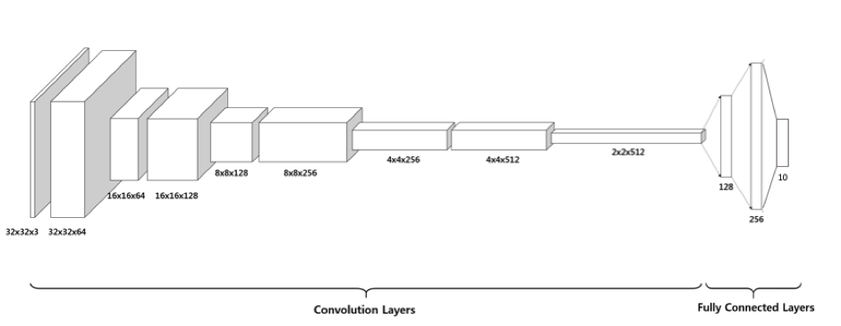

# AML_Final_Project_For_CIFAR_Image_Classification

Nowadays, deep learning plays an important role in our daily life. Image classification is a fundamental and progressive problem in the deep learning field. People try to teach computers to recognize an increasing number of types of pictures by building sophisticated convolution networks. 
 
However, there are some difficulties in building efficient and reasonable networks as follows:
1. Too many combinations of hyper parameters -- Since we have lots of options to change the parameter, the combination of hyper parameters is infinite. Therefore, there is no straightforward method to check if we are on right way to improve the model.
2. Robustness of CNN -- The dropout function is dropping connection between neurons with a specific percentage randomly, so the result might fluctuate. If we do not set seed, the result might be different for different trials.
3. Time issue -- Training one convolution neural network is time consuming. The more sophisticated network is, the more time we will consume. Thus, efficiency is also a difficulty for training a convolutional neural network.
 
Our project is to use different numbers of convolutional layers, preprocessing methods and pooling methods on the CIFAR-10 dataset and compare their prediction results. By understanding different layers, we could build efficient networks when tuning the architecture for the better performance.  

+ Contributors:

    + Mengqi Chen (mc4398)
    + Keran Li  (kl2993)
    + Ye Yue   (yy2810)
    + Zhen Li  (zl2632)
